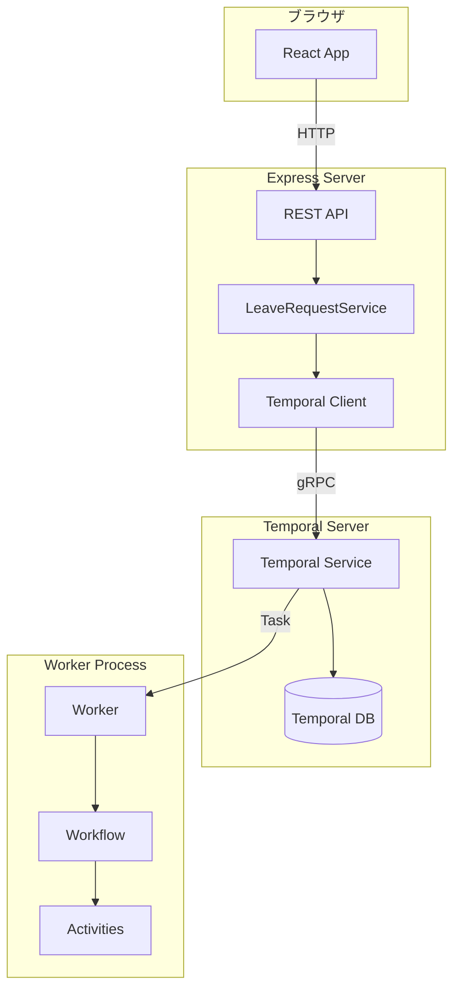
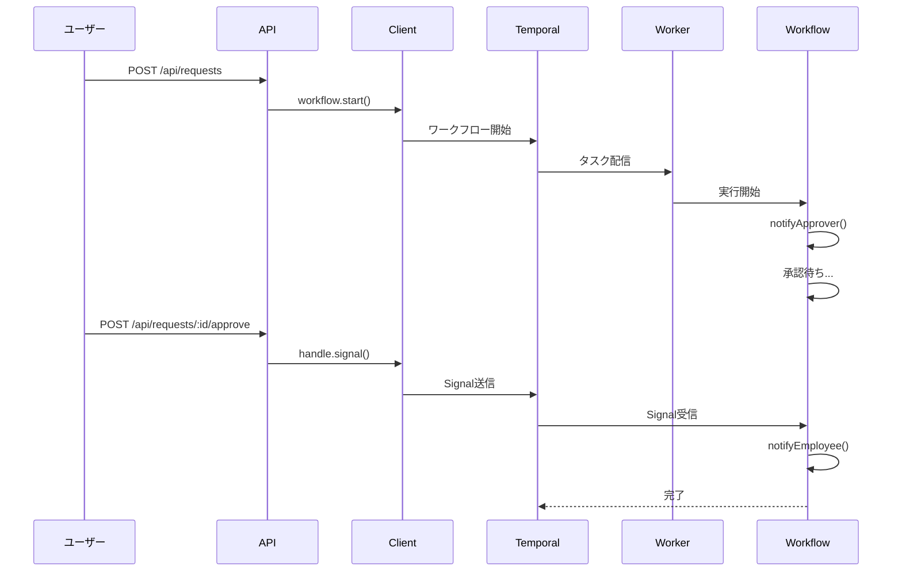
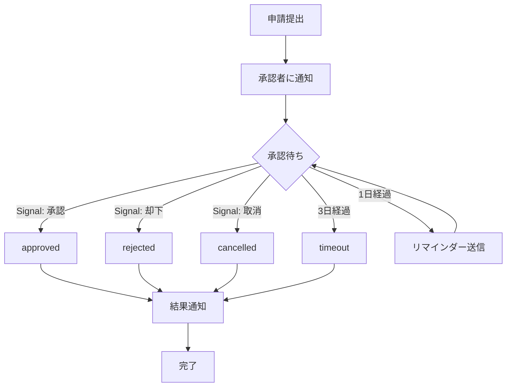
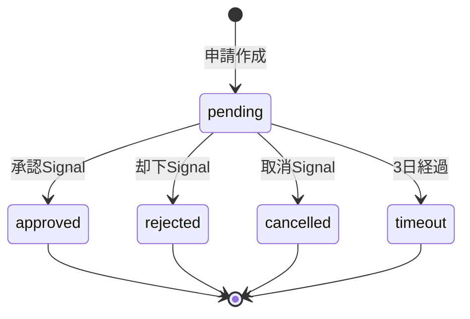

# Temporal 完全ガイド

## 目次

1. [Temporalとは](#temporalとは)
2. [用語集](#用語集)
3. [アーキテクチャ](#アーキテクチャ)
4. [コード解説](#コード解説)
5. [ワークフローの流れ](#ワークフローの流れ)
6. [よくあるエラーと対処法](#よくあるエラーと対処法)
7. [発展例](#発展例)

---

## Temporalとは

Temporalは**ワークフローオーケストレーションプラットフォーム**。長時間実行されるビジネスプロセスを、障害があっても自動的に再開して完了させる。

### なぜTemporalを使うのか

従来の実装と比較すると、Temporalがどれだけ楽かわかる。

| 課題 | 従来の実装 | Temporal |
|------|-----------|----------|
| **状態管理** | DBにステータス保存、更新処理を自前実装 | 自動で永続化（何もしなくてOK） |
| **タイムアウト** | cron + DB監視で実装 | `condition()` の第2引数で指定するだけ |
| **リトライ** | try-catch + 指数バックオフを自前実装 | Activity設定で自動リトライ |
| **外部からの入力** | Webhookエンドポイント + DB更新 | `Signal` を受け取るだけ |
| **障害復旧** | 複雑なリカバリロジックが必要 | 自動で途中から再開 |
| **状態確認** | APIエンドポイント + DB参照 | `Query` で即座に取得 |

---

## 用語集

| 用語 | 説明 | このアプリでの例 |
|------|------|-----------------|
| **Workflow** | ビジネスロジック本体。決定論的（同じ入力→同じ結果） | `leaveRequestWorkflow` - 休暇申請の処理フロー |
| **Activity** | 外部システムとの通信。非決定論的な処理を担当 | `notifyApprover` - 承認者への通知送信 |
| **Signal** | 実行中のワークフローに外部からデータを送信 | `approvalSignal` - 承認/却下の決定を受け取る |
| **Query** | ワークフローの現在状態を取得（読み取り専用） | `getStateQuery` - 申請の現在状態を返す |
| **Timer** | 指定時間の待機。タイムアウト処理に使用 | 承認待ち3日間のタイムアウト |
| **Worker** | ワークフローとアクティビティを実行するプロセス | `worker.ts` - タスクキューを監視して実行 |
| **Task Queue** | WorkerとWorkflowをつなぐキュー | `leave-request-queue` |
| **Client** | ワークフローの開始やSignal送信を行うクライアント | APIサーバーからTemporalへの接続 |

---

## アーキテクチャ

### 全体構成

<div style="background-color: white; padding: 16px; border-radius: 8px;">



</div>

### データフロー

<div style="background-color: white; padding: 16px; border-radius: 8px;">



</div>

### プロジェクト構造

```
temporal/
├── docker-compose.yml      # Temporal + アプリの起動設定
├── server/
│   ├── shared.ts           # 定数（タスクキュー名、タイムアウト日数）
│   ├── types/
│   │   └── leave-request.ts # 型定義
│   ├── temporal/
│   │   ├── activities.ts   # Activity（外部通信）
│   │   ├── workflows.ts    # Workflow（ビジネスロジック）
│   │   └── worker.ts       # Worker（実行プロセス）
│   ├── services/
│   │   └── leave-request.service.ts # サービス層
│   └── api/
│       └── routes/
│           └── leave-requests.ts    # APIエンドポイント
└── web/
    └── src/
        └── routes/         # React画面
```

---

## コード解説

このプロジェクトのコードを、データの流れに沿って順番に解説する。

### 1. 型定義 (`server/types/leave-request.ts`)

まず、アプリ全体で使う型を定義する。

```typescript
// ステータスの種類（5種類）
export type LeaveStatus = 'pending' | 'approved' | 'rejected' | 'timeout' | 'cancelled';

// 休暇申請データ
export interface LeaveRequest {
  requestId: string;       // 一意なID
  employeeName: string;    // 申請者名
  employeeEmail: string;   // 申請者メール
  startDate: string;       // 開始日
  endDate: string;         // 終了日
  reason: string;          // 理由
  approverEmail: string;   // 承認者メール
}

// 承認/却下の決定
export interface ApprovalDecision {
  approved: boolean;       // 承認したか
  comment?: string;        // コメント
  decidedBy: string;       // 決定者
}

// ワークフローの結果
export interface LeaveRequestResult {
  requestId: string;
  status: LeaveStatus;
  decision?: ApprovalDecision;
  cancelReason?: string;
  completedAt: string;
}

// 現在の状態（Query用）
export interface LeaveRequestState {
  request: LeaveRequest;
  status: LeaveStatus;
  submittedAt: string;
  decision?: ApprovalDecision;
  cancelReason?: string;
}
```

**ポイント**:
- `LeaveStatus` は5種類のステータスを定義
- `LeaveRequestState` はワークフロー実行中の状態取得用
- `LeaveRequestResult` はワークフロー完了後の結果用

---

### 2. 共有設定 (`server/shared.ts`)

タスクキュー名やタイムアウト日数など、複数ファイルで使う定数を定義。

```typescript
export const TASK_QUEUE = 'leave-request-queue';  // Worker と Client で同じ名前を使う
export const APPROVAL_TIMEOUT_DAYS = 3;            // 3日でタイムアウト
```

---

### 3. Activity (`server/temporal/activities.ts`)

Activityは**外部システムとの通信**を担当する。メール送信、DB操作、API呼び出しなど。

```typescript
/**
 * 承認者に通知を送信
 * 実際の実装では、SendGrid や Slack API を呼び出す
 */
export async function notifyApprover(request: LeaveRequest): Promise<void> {
  console.log(`承認依頼を送信: ${request.approverEmail}`);
  // TODO: 実際のメール送信処理
}

/**
 * 申請者に結果を通知
 */
export async function notifyEmployee(
  request: LeaveRequest,
  result: LeaveRequestResult
): Promise<void> {
  console.log(`結果を送信: ${request.employeeEmail}`);
  // TODO: 実際のメール送信処理
}

/**
 * リマインダー送信
 */
export async function sendReminder(request: LeaveRequest): Promise<void> {
  console.log(`リマインダー: ${request.approverEmail}`);
}
```

**重要**: Activityは以下の特徴がある
- **非決定論的**でOK（現在時刻取得、ランダム値、外部API呼び出し）
- **自動リトライ**される（設定可能）
- **失敗しても**ワークフローは継続できる

---

### 4. Workflow (`server/temporal/workflows.ts`)

Workflowは**ビジネスロジック本体**。このファイルが最も重要。

```typescript
import {
  proxyActivities,
  defineSignal,
  defineQuery,
  setHandler,
  condition,
} from '@temporalio/workflow';
```

#### 4.1 Activityの取得

```typescript
// Activityをプロキシとして取得（直接インポートしない）
const { notifyApprover, notifyEmployee, sendReminder } = proxyActivities<
  typeof activities
>({
  startToCloseTimeout: '1 minute',  // 1分以内に完了しないとリトライ
});
```

**なぜproxy?**: Workflowは決定論的である必要があるため、Activityを直接呼び出さず、Temporalを経由して実行する。

#### 4.2 Signal と Query の定義

```typescript
// Signal: 外部から承認/却下を受け取る
export const approvalSignal = defineSignal<[ApprovalDecision]>('approval');

// Signal: 外部から取り消しを受け取る
export const cancelSignal = defineSignal<[string]>('cancel');

// Query: 現在の状態を返す
export const getStateQuery = defineQuery<LeaveRequestState>('getState');
```

#### 4.3 ワークフロー本体

```typescript
export async function leaveRequestWorkflow(
  request: LeaveRequest
): Promise<LeaveRequestResult> {
  // ========== 状態変数 ==========
  let status: LeaveStatus = 'pending';
  let decision: ApprovalDecision | undefined;
  let cancelReason: string | undefined;
  const submittedAt = new Date().toISOString();

  // ========== ハンドラー設定 ==========

  // Queryハンドラー: 現在の状態を返す
  setHandler(getStateQuery, () => ({
    request,
    status,
    submittedAt,
    decision,
    cancelReason,
  }));

  // Signalハンドラー: 承認/却下
  setHandler(approvalSignal, (approvalDecision: ApprovalDecision) => {
    if (status === 'pending') {  // pending の時だけ受け付ける
      decision = approvalDecision;
      status = approvalDecision.approved ? 'approved' : 'rejected';
    }
  });

  // Signalハンドラー: 取り消し
  setHandler(cancelSignal, (reason: string) => {
    if (status === 'pending') {
      cancelReason = reason;
      status = 'cancelled';
    }
  });

  // ========== メイン処理 ==========

  // 1. 承認者に通知
  await notifyApprover(request);

  // 2. 承認待ち（タイムアウト + リマインダー付き）
  const timeoutMs = APPROVAL_TIMEOUT_DAYS * 24 * 60 * 60 * 1000;  // 3日
  const reminderIntervalMs = 24 * 60 * 60 * 1000;  // 1日
  const startTime = Date.now();

  while (status === 'pending') {
    // condition: 条件が真になるか、タイムアウトまで待機
    const gotSignal = await condition(
      () => status !== 'pending',  // この条件が真になったら抜ける
      reminderIntervalMs           // 最大1日待つ
    );

    if (gotSignal) break;  // Signalが来た

    // 3日経過したらタイムアウト
    if (Date.now() - startTime >= timeoutMs) {
      status = 'timeout';
      break;
    }

    // まだpendingならリマインダー送信
    if (status === 'pending') {
      await sendReminder(request);
    }
  }

  // ========== 結果作成・通知 ==========
  const result: LeaveRequestResult = {
    requestId: request.requestId,
    status,
    decision,
    cancelReason,
    completedAt: new Date().toISOString(),
  };

  await notifyEmployee(request, result);

  return result;
}
```

**ポイント**:
- `setHandler`: Signal/Queryのハンドラーを登録
- `condition`: 条件が真になるまで待機（タイムアウト指定可能）
- `await`: Activityの完了を待つ
- 状態はローカル変数で管理（Temporalが自動永続化）

---

### 5. Worker (`server/temporal/worker.ts`)

Workerは**ワークフローとActivityを実行するプロセス**。

```typescript
import { Worker, NativeConnection } from '@temporalio/worker';
import * as activities from './activities';
import { TASK_QUEUE } from '../shared';

async function run() {
  // Temporal Server に接続
  const connection = await NativeConnection.connect({
    address: process.env.TEMPORAL_ADDRESS || 'localhost:7233',
  });

  // Worker を作成
  const worker = await Worker.create({
    connection,
    workflowsPath: require.resolve('./workflows'),  // Workflowのパス
    activities,                                      // Activity関数
    taskQueue: TASK_QUEUE,                          // 監視するキュー
  });

  console.log('Worker started');
  await worker.run();  // タスクキューを監視し続ける
}

run().catch(console.error);
```

**重要**:
- `workflowsPath`: ワークフローファイルへのパス（バンドルされる）
- `activities`: Activity関数をオブジェクトで渡す
- `taskQueue`: Client と同じ名前を使う

---

### 6. Service (`server/services/leave-request.service.ts`)

ServiceはAPIとTemporalの橋渡し。Temporal Clientを使ってワークフローを操作する。

```typescript
export class LeaveRequestService {
  constructor(private client: Client) {}

  /**
   * 新規申請を作成
   */
  async submit(input: Omit<LeaveRequest, 'requestId'>): Promise<...> {
    const requestId = `leave-${Date.now()}`;
    const request: LeaveRequest = { requestId, ...input };

    // ワークフローを開始
    const handle = await this.client.workflow.start(leaveRequestWorkflow, {
      taskQueue: TASK_QUEUE,
      workflowId: requestId,  // 一意なID（重複不可）
      args: [request],        // ワークフローへの引数
    });

    return { workflowId: handle.workflowId, request };
  }

  /**
   * 申請一覧を取得
   */
  async listPending(): Promise<LeaveRequestWithWorkflowId[]> {
    // Temporal の検索API
    const workflows = this.client.workflow.list({
      query: `WorkflowType = 'leaveRequestWorkflow'`,
    });

    const requests: LeaveRequestWithWorkflowId[] = [];
    for await (const workflow of workflows) {
      const handle = this.client.workflow.getHandle(workflow.workflowId);
      const state = await handle.query(getStateQuery);  // Query実行
      requests.push({ ...state, workflowId: workflow.workflowId });
    }
    return requests;
  }

  /**
   * 承認
   */
  async approve(workflowId: string, comment?: string): Promise<void> {
    const handle = this.client.workflow.getHandle(workflowId);
    const decision: ApprovalDecision = {
      approved: true,
      comment: comment || '承認しました',
      decidedBy: 'manager@example.com',
    };
    await handle.signal(approvalSignal, decision);  // Signal送信
  }

  /**
   * 却下
   */
  async reject(workflowId: string, comment?: string): Promise<void> {
    const handle = this.client.workflow.getHandle(workflowId);
    const decision: ApprovalDecision = {
      approved: false,
      comment: comment || '却下しました',
      decidedBy: 'manager@example.com',
    };
    await handle.signal(approvalSignal, decision);
  }

  /**
   * 取り消し
   */
  async cancel(workflowId: string, reason?: string): Promise<void> {
    const handle = this.client.workflow.getHandle(workflowId);
    await handle.signal(cancelSignal, reason || '申請者により取り消し');
  }
}
```

**主要なClient操作**:

| 操作 | メソッド | 用途 |
|------|---------|------|
| 開始 | `client.workflow.start()` | 新しいワークフローを開始 |
| 取得 | `client.workflow.getHandle()` | 既存ワークフローへの参照を取得 |
| 一覧 | `client.workflow.list()` | ワークフロー一覧を検索 |
| Signal | `handle.signal()` | ワークフローにデータを送信 |
| Query | `handle.query()` | ワークフローの状態を取得 |
| 結果 | `handle.result()` | ワークフローの完了を待って結果取得 |

---

### 7. API (`server/api/routes/leave-requests.ts`)

REST APIエンドポイント。ServiceのメソッドをHTTPで公開する。

```typescript
export function createLeaveRequestRoutes(service: LeaveRequestService): Router {
  const router = Router();

  // GET /api/requests - 一覧取得
  router.get('/', async (req, res) => {
    const requests = await service.listPending();
    res.json(requests);
  });

  // POST /api/requests - 新規作成
  router.post('/', async (req, res) => {
    const result = await service.submit(req.body);
    res.status(201).json(result);
  });

  // GET /api/requests/:id - 詳細取得
  router.get('/:id', async (req, res) => {
    const request = await service.getById(req.params.id);
    res.json(request);
  });

  // POST /api/requests/:id/approve - 承認
  router.post('/:id/approve', async (req, res) => {
    await service.approve(req.params.id, req.body.comment);
    res.json({ success: true });
  });

  // POST /api/requests/:id/reject - 却下
  router.post('/:id/reject', async (req, res) => {
    await service.reject(req.params.id, req.body.comment);
    res.json({ success: true });
  });

  // POST /api/requests/:id/cancel - 取り消し
  router.post('/:id/cancel', async (req, res) => {
    await service.cancel(req.params.id, req.body.reason);
    res.json({ success: true });
  });

  return router;
}
```

---

## ワークフローの流れ

### フローチャート

<div style="background-color: white; padding: 16px; border-radius: 8px;">



</div>

### ステータス遷移図

<div style="background-color: white; padding: 16px; border-radius: 8px;">



</div>

---

## よくあるエラーと対処法

### 1. Temporal接続エラー

```
Error: Failed to connect to Temporal server
```

**原因**: Temporal Serverが起動していない

**対処**:
```bash
# Temporal の起動確認
docker compose ps

# 再起動
docker compose restart temporal
```

---

### 2. WorkflowNotFoundError

```
WorkflowNotFoundError: workflow not found
```

**原因**: 指定したworkflowIdのワークフローが存在しない

**対処**:
```typescript
try {
  const handle = client.workflow.getHandle(workflowId);
  await handle.query(getStateQuery);
} catch (error) {
  if (error instanceof WorkflowNotFoundError) {
    // ワークフローが存在しない or 完了済み
    console.log('ワークフローが見つかりません');
  }
}
```

---

### 3. Signal送信失敗

```
Error: Workflow execution already completed
```

**原因**: 完了済みのワークフローにSignalを送ろうとした

**対処**:
```typescript
// 送信前に状態を確認
const request = await service.getById(workflowId);
if (request?.status !== 'pending') {
  throw new Error('この申請は既に処理済みです');
}
await service.approve(workflowId, comment);
```

---

### 4. Worker が Task を受け取らない

**原因**: Task Queue名が一致していない

**確認ポイント**:
- `shared.ts` の `TASK_QUEUE` 定数
- `worker.ts` の `taskQueue` 設定
- `service.ts` の `client.workflow.start()` の `taskQueue`

すべて同じ値（`leave-request-queue`）になっているか確認。

---

### 5. Workflowの状態が更新されない

**原因**: Signalハンドラー内での条件分岐

**確認ポイント**:
```typescript
setHandler(approvalSignal, (decision) => {
  // ここの条件が満たされているか？
  if (status === 'pending') {
    status = decision.approved ? 'approved' : 'rejected';
  }
});
```

---

## 発展例

### 1. 多段階承認

部長→課長→人事の順に承認が必要な場合:

```typescript
// Signal定義を拡張
export const managerApprovalSignal = defineSignal<[ApprovalDecision]>('managerApproval');
export const hrApprovalSignal = defineSignal<[ApprovalDecision]>('hrApproval');

export async function multiStageApprovalWorkflow(request: LeaveRequest) {
  let managerApproved = false;
  let hrApproved = false;

  setHandler(managerApprovalSignal, (decision) => {
    if (!managerApproved) managerApproved = decision.approved;
  });

  setHandler(hrApprovalSignal, (decision) => {
    if (managerApproved && !hrApproved) hrApproved = decision.approved;
  });

  // 部長承認待ち
  await notifyManager(request);
  await condition(() => managerApproved, '7 days');

  if (!managerApproved) return { status: 'rejected_by_manager' };

  // 人事承認待ち
  await notifyHR(request);
  await condition(() => hrApproved, '7 days');

  return { status: hrApproved ? 'approved' : 'rejected_by_hr' };
}
```

---

### 2. Slack通知の実装

```typescript
// activities.ts
import { WebClient } from '@slack/web-api';

const slack = new WebClient(process.env.SLACK_TOKEN);

export async function sendSlackNotification(
  channel: string,
  message: string
): Promise<void> {
  await slack.chat.postMessage({
    channel,
    text: message,
    blocks: [
      {
        type: 'section',
        text: { type: 'mrkdwn', text: message },
      },
      {
        type: 'actions',
        elements: [
          {
            type: 'button',
            text: { type: 'plain_text', text: '承認' },
            style: 'primary',
            action_id: 'approve',
          },
          {
            type: 'button',
            text: { type: 'plain_text', text: '却下' },
            style: 'danger',
            action_id: 'reject',
          },
        ],
      },
    ],
  });
}
```

---

### 3. カスタムタイムアウト

申請ごとに異なるタイムアウトを設定:

```typescript
interface LeaveRequestWithTimeout extends LeaveRequest {
  timeoutDays?: number;  // デフォルト3日
}

export async function leaveRequestWorkflow(
  request: LeaveRequestWithTimeout
): Promise<LeaveRequestResult> {
  const timeoutDays = request.timeoutDays ?? 3;
  const timeoutMs = timeoutDays * 24 * 60 * 60 * 1000;

  // ...
  await condition(() => status !== 'pending', timeoutMs);
  // ...
}
```

---

## Temporal UI

http://localhost:8080 でワークフローの実行状況を確認できる。

### 確認できる情報

- **ワークフロー一覧**: 実行中・完了済みのワークフロー
- **実行履歴**: 各ステップのイベント（Activity開始・完了、Signal受信など）
- **入力/出力データ**: ワークフローに渡された引数と結果
- **Signal/Query履歴**: 送受信されたSignalとQueryの履歴

### デバッグ時の活用

1. ワークフローIDで検索
2. 「History」タブでイベント一覧を確認
3. エラーがあれば「Failed」イベントの詳細を確認
